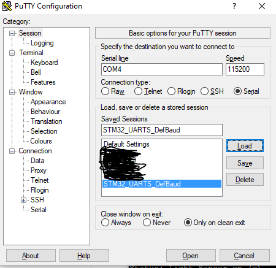

# Xmas Side Project 2024/25 - Embedded Rust on STM32-NUCLEO-F767ZI

This repository is a xmas holiday side project on the development board STM32-NUCELO-F767ZI. This git repository documents the exploration of the Rust embedded world with the asynchronous framework [Embassy](https://embassy.dev/).

**Table of Contents**

- [Xmas Side Project 2024/25 - Embedded Rust on STM32-NUCLEO-F767ZI](#xmas-side-project-202425---embedded-rust-on-stm32-nucleo-f767zi)
  - [Hardware Setup](#hardware-setup)
  - [Supported Features and Roadmap](#supported-features-and-roadmap)
  - [How to get started](#how-to-get-started)
    - [LED Counter](#led-counter)
    - [LED Blinker](#led-blinker)
    - [Uart Echoing](#uart-echoing)
    - [Sensor Platform (Main Project)](#sensor-platform-main-project)
  - [Datasheets, References and Manuals](#datasheets-references-and-manuals)
  - [License - Dual Licensing Apache or MIT at your choosing](#license---dual-licensing-apache-or-mit-at-your-choosing)

## Hardware Setup

The used hardware is shown in the picture below. On the right you see a A STM32-NUCELO-F767ZI it is connected to a PC via micro USB. The bread board on the left side has a power control, although it is powered by the NUCLEO in this picture. Continuing from bottom to top, the red wires connect to a 4.7k resistance each to act as starting line for SCL and SDA of the I2C bus (white and black wires). The small IC connected to the bus is a BH1750FVI light sensor. The next sensor is a DS18B20 temperature sensor that uses the 1-Wire Bus protocol... 


## Supported Features and Roadmap

The main project shall is a sensor platform powered by [Embassy](https://embassy.dev/). It supports the following features so far and has an open roadmap:

- [x] Module for simple LED controls (on/toggle/off)
- [x] Remote LED control via UART
- [x] Support of BH1750FVI light sensor via I2C (single and continious reading) 
- [x] Remote Light Sensor control via UART
- [x] Status Report via UART
- [ ] Support of DS18B20 temperature sensor 
  - [ ] Implement 1-wire driver
- [ ] Add a display showing temperature
  - [ ] Control display light by Lux measured by DS18B20
- [ ] Build small HTTP server for status reports over ETH module of NUCLEO

Besides the main project, this repository consists of the following sub-projects, mainly used as starters and proof of concepts to ensure things work the way intended:

- LED Counter based upon embedded Rust Book, uses PAC-level abstraction.
- LED Blinker based upon embassy starting example, uses async and embassy to implement a binary LED based counting.
- UART Echoing based upon embassy ensure there are debug messages accessible and use UART for both sending and receiving.

## How to get started

We start with the sub-projects for testing from simple to complex to finally arrive at the sensor platform project.

1. LED Counter
2. LED Blinker
3. UART Echoing
4. Sensor Plattform

Assumptions: 

- Hardware sanity check with the official STM tools done successfully. That means the STM Cube Programmer software can be used to connect over STLink.
- Installation as described in [Rust Embedded Book - Hardware](https://docs.rust-embedded.org/book/start/hardware.html) which is based on the [Cortex Quickstart Template](https://github.com/rust-embedded/cortex-m-quickstart).

### LED Counter

The LED Counter project acts as a 

1. If not running, start OpenOCD `openocd -f interface/stlink.cfg -f target/stm32f7x.cfg`
2. Switch to folder `cd led_counter`
3. Execute `cargo run --release`

You should see `Breakpoint 4, 0x08000254 in main ()` in gdb. Type `continue` and the counting started.

Observe the binary counting using GREEN LED for 1 bit, BLUE for 2nd bit and RED for 3rd bit. **It's to fast isn't it?** - we use busy loop here so you can redo it without release:

4. Execute `cargo run`

to reduce the counter frequency. You can [see the code here](./led_counter/src/main.rs)

### LED Blinker

LED Blinker acted as a starter for getting in touch with the [Embassy Framework](https://embassy.dev/).

1. If not running, start OpenOCD `openocd -f interface/stlink.cfg -f target/stm32f7x.cfg`
2. Switch to folder `cd embassy`
3. Execute `cargo run --bin example_led_blinking --release`

Use gdb to continue from main.

You should witness the blue LED blinking and you can use the blue user button to raise the frequency of the blinking. You can [see the code here](./embassy/src/bin/example_led_blinking.rs)

### Uart Echoing

Uart Echoing was a small project to get UART running within embassy. As this is very helpful for debug messages and to control the embedded device via a simple command language.

1. If not running, start OpenOCD `openocd -f interface/stlink.cfg -f target/stm32f7x.cfg`
2. Switch to folder `cd embassy`
3. Execute `cargo run --bin example_uart_echoing --release`

Use gdb to continue from main.

Next we have to setup a remote program that is used to connect over the UART protocol using the USB connection to the PC of the NUCLEO. I used putty on Windows for that with the following settings:



You should also check that a return is needed to sent the message in the settings.

The buffer is eight bytes long so if you write `12345678` and ensure it is send (e.g. pressing return) you should see the first echo. You can [see the code here](./embassy/src/bin/example_uart_echoing.rs)


### Sensor Platform (Main Project)

This is the main project - Besides the previous projects it does consist of several files and is currently mainly controled with UART.

It supports the following commands:

- LED Control

```
led <color-code> <function> 
color-code = r|g|b - for red, green and blue user LEDs respectively
function = on|off|<number in ms> - turns the led on or off, or if a number is given toggles the LED every given ms
```

- Light Sensor Control

```
light <state>
state = off|single|continious - s or c may be used as short form. Turns on the light sensor for measurment or shuts it down.
```

- Uart Report Interval

```
status <number in ms>
number in ms = the ms between each UART based status report, default is 10000ms
```

Here you see an example output over the UART console:


1. If not running, start OpenOCD `openocd -f interface/stlink.cfg -f target/stm32f7x.cfg`
2. Switch to folder `cd embassy`
3. Execute `cargo run --bin example_sensors --release`

Use gdb to continue from main.

You can [see the main code file here](./embassy/src/bin/example_sensors.rs)

## Datasheets, References and Manuals

A list of data sheets, references and manuals for the hardware setup used in this Repository.

- [DS18B20 - Programmable Resolution 1-Wire Digital Thermometer](https://cdn-reichelt.de/documents/datenblatt/A200/DS18B20Z-DAL.pdf)
- [BH1750FVI - Digital 16bit Serial Output Type Ambient Light Sensor IC](https://cdn-reichelt.de/documents/datenblatt/A300/SENSOR_BH1750.pdf)
- [STM32 NUCLEO-144 - User Manual](https://www.st.com/resource/en/user_manual/um1974-stm32-nucleo144-boards-mb1137-stmicroelectronics.pdf)
- [STM32 - Shared Reference](https://www.st.com/resource/en/datasheet/stm32f777bi.pdf)
- [STM32F76xxx - RM0410 Reference manual](https://www.st.com/resource/en/reference_manual/rm0410-stm32f76xxx-and-stm32f77xxx-advanced-armbased-32bit-mcus-stmicroelectronics.pdf)
- [I2C-bus - Specification and User Manual Rev. 7](https://www.nxp.com/docs/en/user-guide/UM10204.pdf)

## License - Dual Licensing Apache or MIT at your choosing

All code in this repository is dual-licensed under either:

MIT License ([LICENSE-MIT](./LICENSE-MIT) or http://opensource.org/licenses/MIT)
Apache License, Version 2.0 ([LICENSE-APACHE](./LICENSE-APACHE) or http://www.apache.org/licenses/LICENSE-2.0)
at your option. This means you can select the license you prefer! This dual-licensing approach is the de-facto standard in the Rust ecosystem and there are very good reasons to include both.
